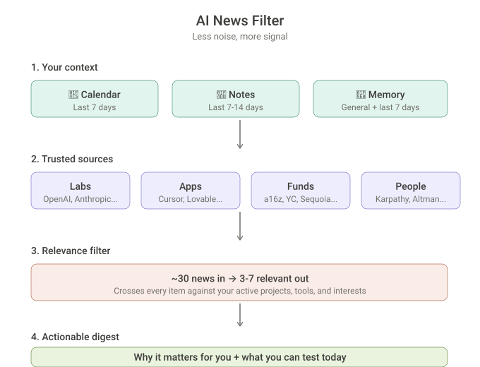

<div align="center">

# 🔍 AI News Filter

**Stop drowning in AI news. Get only what matters for your work.**

[](https://claude.ai)
[](LICENSE)

Built by **[Your Name]** · [LinkedIn](https://linkedin.com/in/yourprofile)

</div>

---

## The story behind this

I was spending way too much energy consuming AI news. Every morning, a wave of announcements, launches, hot takes, funding rounds. And the headlines are designed to make everything feel urgent.

But here's what I realized:

**Consuming news — not just AI news — only generates anxiety.** It's impossible to keep up with everything. And 99% of what comes out is irrelevant to your actual life and work, no matter how loud the headline is.

So I started thinking about what a healthier relationship with AI news would look like. I landed on three principles:

### 1. Consume only from trusted sources

Not everything deserves your attention. I narrowed it down to four categories of sources I actually trust:

- **Labs** (who builds the models): OpenAI, Anthropic, Google DeepMind, Meta AI, Mistral
- **Apps** (who builds on the models): Cursor, Lovable, ElevenLabs, Replit, Perplexity
- **Funds** (who invests in both): Sequoia, a16z, Y Combinator
- **Key people** (who shapes the thinking): Andrej Karpathy, Sam Altman, Dario Amodei, Elena Verna, among others

If it's not coming from one of these, it's probably noise.

### 2. Filter ruthlessly

Even from trusted sources, 90% of what comes out isn't relevant to *my* work. A new image generation model doesn't matter if I'm building enterprise workflows. A funding round in biotech AI doesn't change my week.

The filter I needed wasn't topic-based ("AI news") — it was **context-based** ("AI news that connects with what I'm actually doing right now").

### 3. Test, don't just read

It doesn't matter how many people say something is incredible. I don't know if it's real until I test it with my own hands. So the output needs to tell me not just *what happened* but *what I can try today*.

---

## So I built this

I turned these three principles into a system that runs inside Claude. Here's how it works:

<div align="center">



</div>

**Step 1 — It reads your real context.** It pulls from your calendar (last 7 days), your notes (last 7-14 days), and Claude's memory of your recent conversations. This builds a relevance profile: what are you working on, what tools are you using, what's on your mind this week.

**Step 2 — It searches only trusted sources.** 8-15 targeted web searches across Labs, Apps, Funds, and Key People. Primary sources only — official blogs, direct posts, published papers. No aggregators, no SEO content.

**Step 3 — It filters by relevance.** Every news item gets crossed against your context. Does it impact a project you're working on? Does it involve a tool you already use? Can you test it today? If not, it gets cut.

**Step 4 — It delivers 3-7 actionable items.** Each one explains *why it matters for you specifically*, not just what happened. Testable items include the path: which tool, which action, which link.

The result: instead of 45 minutes scrolling through noise, you spend 5 minutes reading what actually connects with your work.

---

## What you get

<table>
<tr>
<td width="50%">

### ❌ Without the filter

- 30+ articles across random sources
- Most are irrelevant to your work
- No way to know what to test
- 45 min scrolling, nothing actionable
- Anxiety from feeling behind

</td>
<td width="50%">

### ✅ With the filter

- 3-7 items from trusted sources only
- Each one explains why it matters **for you**
- Testable items include how-to steps
- 5 min reading, clear next actions
- Calm from knowing you saw what matters

</td>
</tr>
</table>

---

## How to set it up (5 minutes, no downloads)

Everything below is copy and paste. No files to download, no packages to install.

### Step 1 — Create a project in Claude

1. Go to [claude.ai](https://claude.ai)
2. On the left sidebar, click **Projects**
3. Click **Create Project**
4. Name it `AI News Filter`

### Step 2 — Paste the project instructions

Inside your new project, click the ⚙️ icon to open project settings. Find the **Project Instructions** field.

Click the 📋 button in the top-right corner of the box below to copy, then paste it in.

```
Project Instructions — AI News Filter

Skill

This project uses the skill "ai-news-filter". When the user asks for AI news, updates, digest, or says /news, always activate this skill and follow its full instructions.

Purpose

This project is a personalized AI news curation system. It pulls news from trusted sources, crosses them with the user's real-world context (projects, calendar, recent activity), and delivers only what's relevant. Less noise, more signal.

Connected Tools

This project relies on:
- Web search — to fetch news from trusted sources
- Google Calendar — to read recent events and infer active focus areas
- Notion — to read recent pages/databases and identify active projects
- Claude's memory + recent conversations — to build the user's relevance profile

Default Trusted Sources

These are the starting defaults. You can add or remove sources at any time.

Labs (model makers): OpenAI, Anthropic, Google DeepMind, Meta AI, Mistral, Cohere, Stability AI, Midjourney

Apps (model consumers): Lovable, ElevenLabs, Cursor, Replit, Higgsfield, Vercel (v0), Perplexity, Notion AI, Canva AI, Figma AI

Funds (investors): Sequoia, a16z, Y Combinator, Lightspeed, Accel

Key People: Elena Verna, Boris Cherny, Andrej Karpathy, Tariq Shihipar, Sam Altman, Dario Amodei, Garry Tan, Satya Nadella, Jensen Huang, Demis Hassabis

User Customization

The user can personalize the skill over time by asking to:
- Add or remove trusted sources (companies, people, funds)
- Adjust the relevance filter (broader or stricter)
- Change frequency (daily, 2x/week, weekly)
- Add specific topics to monitor
- Block topics they don't care about

When the user makes any of these requests, save the change to Claude's memory so it persists across conversations. Always confirm what was saved.

Language

Respond in the same language the user writes in.
```

### Step 3 — Paste the skill prompt

Still in the project settings, find the **Custom Instructions** or **Skills** section and click **Add Content**.

Click the 📋 button in the top-right corner of the box below to copy, then paste it in.

```
---
name: ai-news-filter
description: "Personalized AI news curation with relevance filtering. ALWAYS use this skill when the user asks for: AI news, AI updates, 'what happened in AI', 'news digest', 'AI summary', 'what do I need to know today', 'run the news filter', '/news', 'AI curation', 'AI digest', 'AI briefing'. Also trigger when the user asks 'anything new in AI?', 'what came out today?', 'lab updates', 'what did OpenAI/Anthropic/Google launch'. DO NOT use for technical AI questions, tutorials, or opinions about specific tools."
---

# AI News Filter — Personalized AI News Curation

Inspired by Deborah Folloni's method: consume fewer AI news, but better ones, filtered by what actually matters for your projects and life.

## Principles

1. Trusted sources only — no generic aggregators or clickbait
2. Relevance filter — cross-reference news with the user's real context
3. Test > accumulate — highlight what's testable and actionable, not just informational

## Step 1 — Gather user context

Before searching for news, gather the context that will serve as the relevance filter. Use all available sources:

### 1a. Claude's memory
Two layers:
- General memory: everything you already know about the user (projects, field of work, tools they use, declared interests, role, company). This forms the base relevance profile.
- Last 7 days of conversations: search recent chats using the conversation search tool. Extract mentioned projects, tools tested, recurring questions, and topics where the user showed active interest. This captures the hot context — what's on the user's mind right now.

### 1b. Calendar (last 7 days)
Fetch events from the last 7 days. Extract:
- Project names mentioned in event titles
- Meetings with clients or partners (indicate focus areas)
- Workshops, demos, or presentations that happened (indicate hot topics)

### 1c. Notes (last 14 days + last 7 days)
Two time windows:
- Last 14 days: search for pages indicating active projects and strategic direction. Look for pages with "project", "roadmap", "sprint", "OKR", "planning" in the title. This captures the big picture of what's in progress.
- Last 7 days: search for recently edited pages (any type). This shows where the user is putting energy right now, which tasks and documents are hot.

### Context synthesis
Compile an internal list (do not show to the user) with:
- Active projects: list of 3-8 projects/themes
- Tools in use: which platforms and models the user uses
- Field of work: sector, role, type of decisions they make
- Declared interests: topics the user has mentioned wanting to follow

If a source is unavailable (no calendar or notes connected), skip it and work with what you have. Memory alone is enough to build a useful filter.

## Step 2 — Search news from trusted sources

Search the web covering the 4 categories of trusted sources (Labs, Apps, Funds, Key People). Use 8-15 searches to cover the ground well. Searches should cover the last 7 days unless the user requests a different period.

Labs: OpenAI, Anthropic, Google DeepMind, Meta AI, Mistral, Cohere, Stability AI, Midjourney
Apps: Lovable, ElevenLabs, Cursor, Replit, Higgsfield, Vercel (v0), Perplexity, Notion AI, Canva AI, Figma AI
Funds: Sequoia, a16z, Y Combinator, Lightspeed, Accel
Key People: Elena Verna, Boris Cherny, Andrej Karpathy, Tariq Shihipar, Sam Altman, Dario Amodei, Garry Tan, Satya Nadella, Jensen Huang, Demis Hassabis

Search rules:
- Prefer primary sources: official company blogs, direct posts from key people, published papers
- When a result looks relevant, use web_fetch to read the full content
- Discard results from low-quality sites, SEO aggregators, or republished content
- Include the date for each piece of news

## Step 3 — Filter by relevance

For each piece of news found, evaluate relevance using the context from Step 1:

High relevance (always include):
- Directly impacts an active project of the user
- Involves a tool the user already uses
- Opens a concrete opportunity for the user's work
- Is testable now (new feature, API, free tool)

Medium relevance (include if few high-relevance items):
- Related to the user's sector but no direct impact
- Important trend that may affect future decisions
- Relevant market movement (funding, acquisition, partnership)

Low relevance (discard):
- Generic news with no connection to the user's context
- Unconfirmed rumor
- Minor update with no practical impact
- Social media drama without substance

Target: deliver between 3 and 7 news items, never more than 10.

## Step 4 — Deliver in chat

Write the response directly in chat, in the user's language, following this structure:

Start with one sentence contextualizing the period and intensity (quiet day, busy week, etc.).

Then, for each piece of news:

**Title** — Source
2-3 sentence summary explaining what happened and why it matters for the user specifically. If testable, say how.

Writing rules:
- Direct and practical tone, no sensationalism
- Always say why that news matters for the user, connecting to their project context
- If something is testable, include the path: "You can test this in [tool] by doing [action]"
- Don't repeat the same news from different angles
- Always paraphrase, never copy snippets from sources
- Cite the original source with link when available

End with a short "To test" section listing the 1-3 most actionable items from the digest, if any.
```

### Step 4 — Connect your tools (optional but recommended)

The skill works with just Claude's memory. But connecting these makes the filter much sharper:

| Tool | What it adds | How to connect |
|---|---|---|
| 📅 **Google Calendar** | Reads your last 7 days to infer what you've been focused on | Claude.ai → Settings → Connected Apps → Google Calendar |
| 📝 **Notion** | Reads recent pages to identify active projects | Claude.ai → Settings → Connected Apps → Notion |

### Step 5 — Run it

Open a conversation inside the project and say any of these:

- `AI news`
- `/news`
- `What happened in AI this week?`
- `Run the news filter`

That's it. Claude will gather your context, search trusted sources, filter by relevance, and deliver 3-7 actionable news items.

### Step 6 — Schedule it weekly (optional)

To run it automatically every week without asking:

1. Open **Claude Desktop → Cowork**
2. Create a new task: `Run the AI News Filter skill`
3. Set it to **repeat weekly** on the day you prefer (e.g. every Friday at 8am)

---

## Customize it anytime

Just tell Claude what you want inside the project. Changes persist across conversations.

| Say this | What happens |
|---|---|
| "Add Hugging Face to my sources" | New source tracked |
| "I don't care about image generation" | Topic blocked |
| "Make the filter broader" | More items per digest |
| "Also monitor AI regulation" | New topic added |
| "Remove Midjourney" | Source removed |

---

## Why I made these technical decisions

**Three layers of context** — Memory alone gives you the big picture but misses what's hot this week. Calendar alone shows meetings but not projects. Notes alone shows documents but not conversations. The three together build a context that's both deep and current.

**3-7 items, never more than 10** — This is a deliberate constraint. More than 10 and you're back to scrolling. The filter needs to be aggressive enough that what survives is genuinely worth your time.

**Sources separated from logic** — The trusted sources are listed explicitly so you can edit them without touching the core prompt. Add a company, remove a person, block a topic — all without breaking anything.

---

## Inspiration

This project is inspired by [Deborah Folloni's method](https://www.linkedin.com/in/deborahfolloni/) for consuming less AI news while staying informed about what actually matters.

Her insight — that you don't need to know everything, just what connects with your work — is what drove the entire design.

---

<div align="center">

MIT License

</div>
